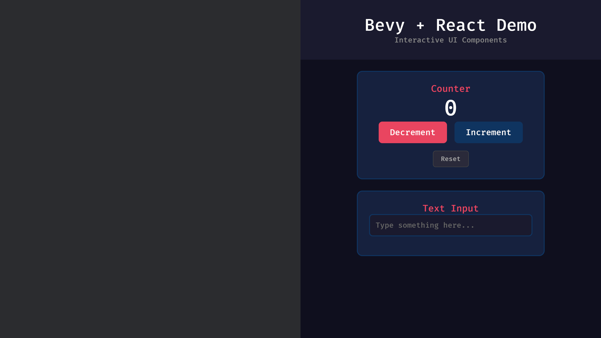
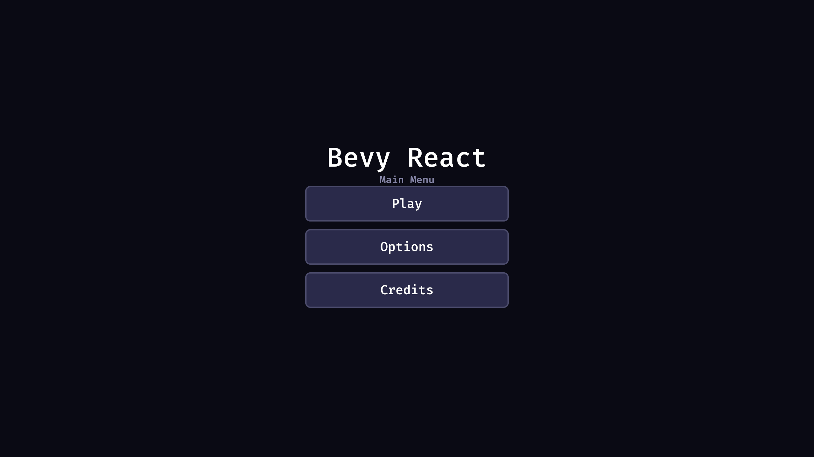
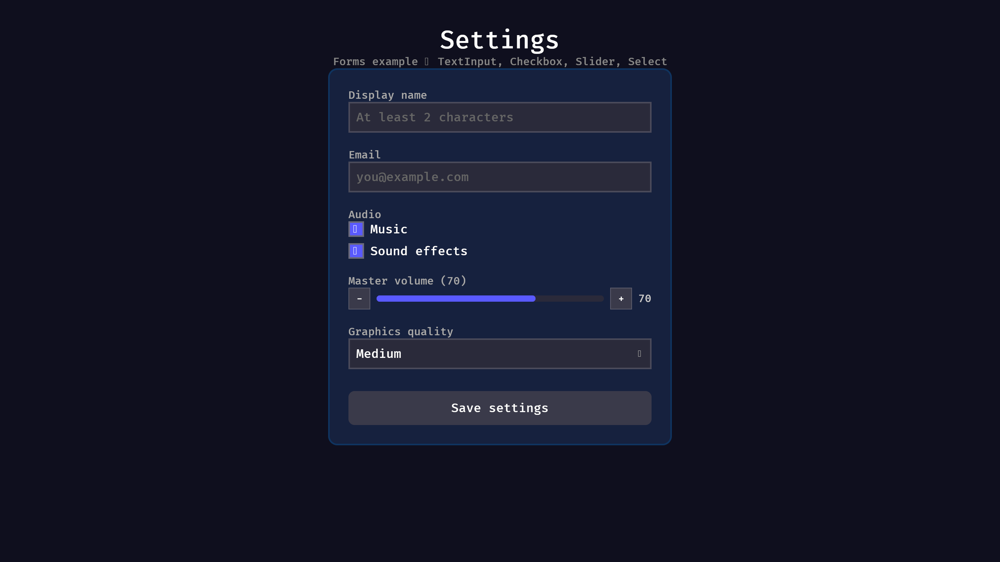

# bevy-react

Build UI for your [Bevy](https://bevy.org/) app using React. A custom React renderer generates [Bevy UI](https://docs.rs/bevy/latest/bevy/ui/index.html) components natively in your Bevy ECS with bidirectional interactivity (e.g. onClick, hover, keyboard events).

## Features

* **It's just React**: Full support for React features including State, Hooks, Context, functional components, etc.
* **Built on Bevy UI**: Renders directly to `bevy_ui` components (`Node`, `Text`, `ImageNode`, `Button`).
* **Hot Reloading**: Supports Vite-based HMR for instant UI updates without recompiling.

## Current Status

Early prototype — **don't use this in production yet.** Core render/input/examples work (see the [demo](examples/demo/)). Next focus is the typed bridge, host-side interaction styling, and Bevy widgets — not more epic polish on the old foundation. Track progress in [docs/PROJECT_PLAN.md](docs/PROJECT_PLAN.md).

| Package | Version | Registry |
|---|---|---|
| `bevy_react` (Rust) | 0.1.0 | not published |
| `bevy-react` (npm) | 0.1.0 | not published |

Pinned to **Bevy 0.17.3** and **React 19**. See [Bevy version support](docs/BEVY_VERSION.md) for the support policy and tracking matrix.

## Examples

| [Demo](examples/demo/) | [Menu](examples/menu/) | [Forms](examples/forms/) | [HUD](examples/hud/) |
| --- | --- | --- | --- |
|  |  |  |  |
| Bevy + Vite starter with HMR | Full-screen menu and navigation | TextInput, Checkbox, Slider, Select | ECS stats via `ReactBridge` |

See [docs/EXAMPLES.md](docs/EXAMPLES.md) for run instructions.

## Documentation

| Doc | Description |
|---|---|
| [Getting Started](docs/GETTING_STARTED.md) | Local setup and first UI |
| [Style Props](docs/STYLE_PROPS.md) | Supported CSS-like style properties |
| [Architecture](docs/ARCHITECTURE.md) | How the two-runtime bridge works |
| [Data Bridge](docs/BRIDGE.md) | Push ECS state into React / call Rust from JS |
| [Boa Compat](docs/BOA_COMPAT.md) | JS APIs that work / are shimmed / missing in Boa |
| [Examples](docs/EXAMPLES.md) | Demo, menu, forms, HUD |
| [Demo smoke](docs/DEMO_SMOKE.md) | Manual checklist + automated smoke script |
| [Bevy Version](docs/BEVY_VERSION.md) | Support policy + version matrix |
| [Project Plan](docs/PROJECT_PLAN.md) | Bridge-first roadmap |
| [Contributing](CONTRIBUTING.md) | How to contribute |
| [Changelog](CHANGELOG.md) | Release notes |

## Quick Start

Prefer the documented path in [Getting Started](docs/GETTING_STARTED.md). Short version:

1. Run the Vite UI (`examples/demo/ui`) and the Bevy host (`examples/demo`).
2. Or path-depend the crate / link the TS package from this repo (packages are not on crates.io/npm yet).

```rust
use bevy::prelude::*;
use bevy_react::{ReactBundle, ReactPlugin, ViteDevSource, js_bevy::JsPlugin};

fn main() {
    App::new()
        .add_plugins(DefaultPlugins)
        .add_plugins(JsPlugin)
        .add_plugins(ReactPlugin)
        .add_systems(Startup, setup)
        .run();
}

fn setup(mut commands: Commands) {
    commands.spawn(Camera2d);

    let js_source = ViteDevSource::default()
        .with_entry_point("src/main.tsx")
        .into();

    commands.spawn(ReactBundle::new(
        Node {
            width: Val::Percent(50.0),
            height: Val::Percent(100.0),
            left: Val::Percent(50.0),
            position_type: PositionType::Absolute,
            ..default()
        },
        js_source,
    ));
}
```

```tsx
import { useState } from "react";
import { createBevyApp, Node, Text, Button } from "bevy-react";

function App() {
  const [count, setCount] = useState(0);
  return (
    <Node>
      <Text>Count: {count}</Text>
      <Button onClick={() => setCount(count + 1)}>Increment</Button>
    </Node>
  );
}

export default createBevyApp(<App />);
```

## How it works

`bevy-react` consists of two parts:

1. **Host (Rust)**: A Bevy plugin that embeds the [Boa](https://github.com/boa-dev/boa) JavaScript engine. It exposes a channel-based protocol for communicating with the UI and JS runtime.
2. **Client (JS/TS)**: A custom [React Reconciler](https://www.npmjs.com/package/react-reconciler) that translates React Virtual DOM operations into native function calls which are sent back to the Rust host.

See [Architecture](docs/ARCHITECTURE.md) for details.

## License

MIT — see [LICENSE](LICENSE).
