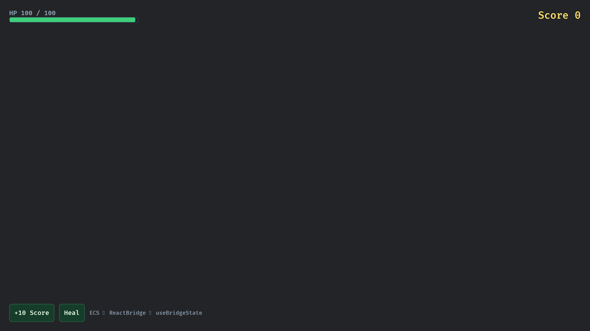

# HUD Example



Binds Bevy ECS player stats into React via [`ReactBridge`](../../docs/BRIDGE.md):

- Rust registers `PlayerStats` with `register_resource_store("hud")`
- React reads with `useResource('hud', …)` (HP ratio derived on the TS side)
- Buttons call `add_score` / `heal` through Promise-returning `callNative`
- Shared JSON shape: `ui/src/hudTypes.ts` ↔ Rust `PlayerStats`

## How to run

```bash
cd ui
pnpm install --ignore-scripts
pnpm dev
```

In another terminal:

```bash
cargo run --manifest-path examples/hud/Cargo.toml
```

## Production bundle

```bash
cd examples/hud/ui && pnpm build
cargo run --manifest-path examples/hud/Cargo.toml --release
```
